# BabySitter 业务功能文档

> 最后更新：2026-09-07

## 目录

- [1. 应用概览](#1-应用概览)
- [2. 技术架构](#2-技术架构)
- [3. 页面与路由](#3-页面与路由)
- [4. 核心功能模块](#4-核心功能模块)
  - [4.1 宝宝管理](#41-宝宝管理)
  - [4.2 喂养记录](#42-喂养记录)
  - [4.3 纸尿裤记录](#43-纸尿裤记录)
  - [4.4 吸奶记录](#44-吸奶记录)
  - [4.5 睡眠记录](#45-睡眠记录)
  - [4.6 成长记录](#46-成长记录)
  - [4.7 辅食记录](#47-辅食记录)
  - [4.8 用药记录](#48-用药记录)
  - [4.9 疫苗记录](#49-疫苗记录)
  - [4.10 体温记录](#410-体温记录)
  - [4.11 里程碑记录](#411-里程碑记录)
- [5. 计时器系统](#5-计时器系统)
- [6. 仪表盘](#6-仪表盘)
- [7. 时间线日志](#7-时间线日志)
- [8. 统计分析](#8-统计分析)
- [9. 提醒系统](#9-提醒系统)
- [10. 数据导入导出](#10-数据导入导出)
- [11. 设置页](#11-设置页)
- [12. 数据模型](#12-数据模型)
- [13. 国际化](#13-国际化)
- [14. PWA特性](#14-pwa特性)

---

## 1. 应用概览

BabySitter 是一款面向新手父母的宝宝日常记录 PWA 应用。支持记录喂养、纸尿裤、吸奶、睡眠、成长、辅食、用药、疫苗、体温、里程碑共 10 种日常数据，提供实时统计、趋势图表、智能提醒、CSV 数据导入导出等功能。

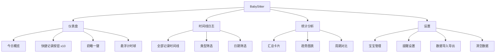

---

## 2. 技术架构

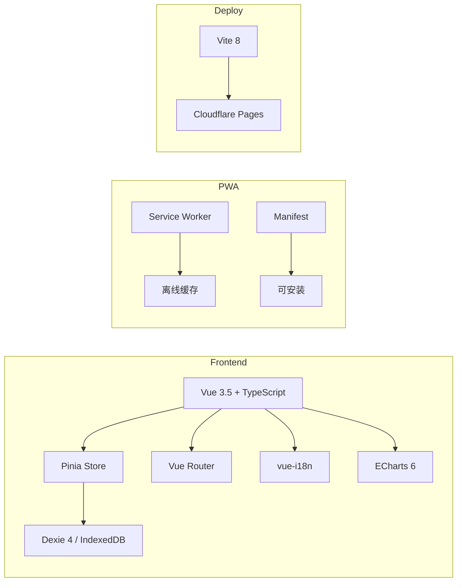

| 技术 | 版本 | 用途 |
|------|------|------|
| Vue | 3.5 | 前端框架 |
| Pinia | - | 状态管理 |
| Dexie | 4.x | IndexedDB 封装 |
| ECharts | 6.x | 图表可视化 |
| vue-i18n | - | 国际化 |
| Vite | 8.x | 构建工具 |
| vite-plugin-pwa | 1.3 | PWA 支持 |

---

## 3. 页面与路由

```mermaid
graph TD
    R[路由 /] --> DASH[DashboardView 仪表盘]
    R2[/log] --> LOG[LogView 时间线日志]
    R3[/stats] --> STATS[StatsView 统计分析]
    R4[/settings] --> SETTINGS[SettingsView 设置]
    R5[/:pathMatch] -->|兜底| DASH
```

| 路径 | 页面 | 说明 |
|------|------|------|
| `/` | 仪表盘 | 首页，今日概览 + 快捷记录 |
| `/log` | 时间线日志 | 全部记录列表，支持筛选 |
| `/stats` | 统计分析 | 汇总/趋势/对比三视图 |
| `/settings` | 设置 | 宝宝管理、提醒、数据管理 |

---

## 4. 核心功能模块

### 4.1 宝宝管理

**数据模型**：`Baby`

| 字段 | 类型 | 说明 |
|------|------|------|
| name | string | 宝宝昵称 |
| gender | 'boy' \| 'girl' | 性别 |
| birthDate | string | 出生日期 YYYY-MM-DD |
| birthWeight | number | 出生体重 kg |
| birthHeight | number | 出生身高 cm |
| avatar | string | 头像 emoji |
| avatarColor | string | 主题色 |

**功能**：
- 支持多宝宝，可切换当前活跃宝宝
- 24 种头像选择（生肖 + 可爱动物）
- 8 种主题色
- 自动计算年龄（天/月/年）

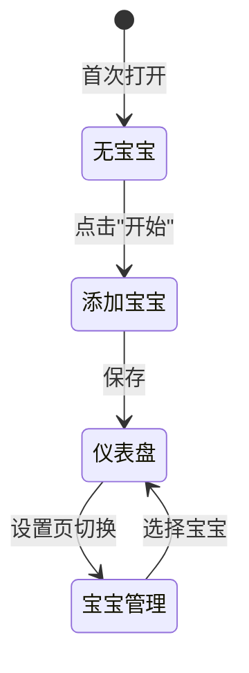

---

### 4.2 喂养记录

**类型体系**：

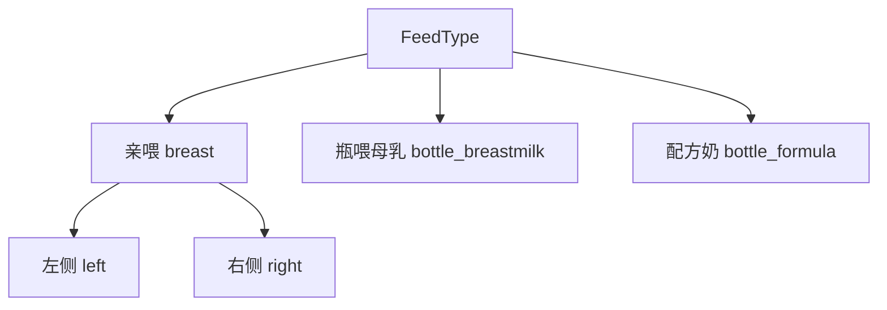

**数据模型**：`Feeding`

| 字段 | 类型 | 说明 |
|------|------|------|
| type | FeedType | 喂养类型 |
| side | BreastSide? | 亲喂侧边（仅亲喂） |
| startTime | number | 开始时间 ms |
| endTime | number? | 结束时间（计时用） |
| duration | number? | 亲喂时长 ms |
| amount | number? | 奶量 ml（瓶喂） |
| notes | string? | 备注 |

**表单逻辑**：
- 亲喂：显示计时器 + 左/右侧边选择 + 结束时间
- 瓶喂：显示奶量输入（ml，必填 > 0）
- 提交时自动计算 duration = endTime - startTime

---

### 4.3 纸尿裤记录

**数据模型**：`DiaperChange`

| 字段 | 类型 | 说明 |
|------|------|------|
| type | DiaperType | wet / dirty / both |
| color | DiaperColor? | 黄/褐/绿/黑/红/其他 |
| amount | DiaperAmount? | 少量/中等/大量 |
| time | number | 记录时间 ms |

---

### 4.4 吸奶记录

**数据模型**：`Pumping`

| 字段 | 类型 | 说明 |
|------|------|------|
| side | PumpSide | left / right / both |
| startTime | number | 开始时间 |
| endTime | number? | 结束时间 |
| duration | number? | 时长 ms |
| amount | number? | 奶量 ml |

支持计时器，逻辑同亲喂。

---

### 4.5 睡眠记录

**数据模型**：`Sleep`

| 字段 | 类型 | 说明 |
|------|------|------|
| type | SleepType | nap / night |
| startTime | number | 入睡时间 |
| endTime | number | 醒来时间 |
| duration | number? | 时长 ms（自动计算） |

支持计时器，`duration = endTime - startTime`。

---

### 4.6 ~ 4.11 其他记录

| 记录类型 | 时间字段 | 关键字段 |
|----------|----------|----------|
| 成长 | date | weight, height, headCircumference |
| 辅食 | time | food, amount |
| 用药 | time | name, dose |
| 疫苗 | date | name, dose, status(planned/done) |
| 体温 | time | value(°C), method(armpit/ear/forehead/rectal) |
| 里程碑 | time | type(roll/sit/crawl/stand/walk/first_word/tooth/wave/other) |

---

## 5. 计时器系统

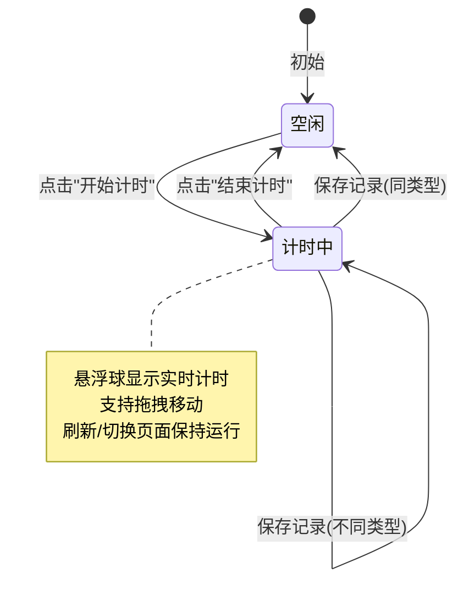

**核心特性**：
- 全局单例（`useActiveTimer`），跨页面/弹窗共享
- 持久化到 localStorage，刷新后自动恢复
- 支持 feeding / sleep / pumping 三种类型
- 悬浮球显示：图标 + 类型标签 + 实时计时（HH:MM:SS）
- 悬浮球可拖拽（触摸 + 鼠标），位置持久化
- 睡眠弹窗打开时悬浮球自动隐藏
- 悬浮球层级（z-index: 100）低于弹窗（z-index: 200）
- 用户设置开始时间后点击计时，使用用户设置的时间而非当前时间

---

## 6. 仪表盘

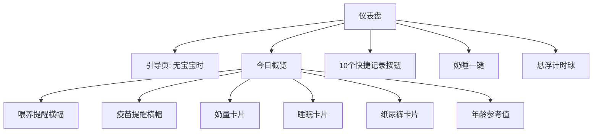

**今日概览卡片**：
- 🍼 奶量：今日总奶量 ml、喂养次数、吸奶量、母乳库存
- 😴 睡眠：今日总睡眠时长
- 🧷 纸尿裤：今日更换次数

**奶睡一键**：同时记录一次喂养 + 一次睡眠（组合操作）

**年龄参考指南**（基于出生日期）：

| 年龄段 | 推荐奶量/次 | 喂养间隔 | 推荐睡眠/天 | 纸尿裤/天 |
|--------|-------------|----------|-------------|-----------|
| 0-1月 | 按需 | 2.5h | 14-17h | 10-12 |
| 1-3月 | 按需 | 3h | 12-16h | 8-10 |
| 3-6月 | 按需 | 3.5h | 12-15h | 8-10 |
| 6-9月 | 辅食+奶 | 4h | 12-14h | 6-8 |
| 9-12月 | 辅食+奶 | 4.5h | 11-14h | 5-6 |
| 12月+ | 三餐+奶 | 5h | 11-13h | 4-5 |

---

## 7. 时间线日志

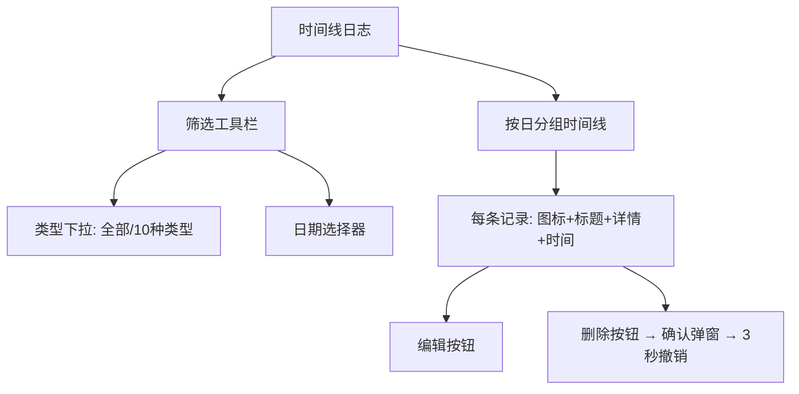

**特性**：
- 全部 10 种记录类型统一展示
- 按日期分组，最新在前
- 类型筛选 + 日期筛选（单日）
- 疫苗仅显示已完成（done）的记录
- 删除支持 3 秒撤销（toast 通知）
- 通过 `?timer=<kind>` 查询参数可自动打开对应计时表单

---

## 8. 统计分析

```mermaid
graph TD
    STATS[统计分析] --> RANGE[时间范围选择]
    STATS --> TAB1[汇总 Tab]
    STATS --> TAB2[趋势 Tab]
    STATS --> TAB3[对比 Tab]

    RANGE --> R1[今日]
    RANGE --> R2[7天/14天/30天]
    RANGE --> R3[本月/全部]

    TAB1 --> C1[10张统计卡片]
    TAB2 --> CH1[奶量趋势线图]
    TAB2 --> CH2[睡眠柱状图]
    TAB2 --> CH3[纸尿裤堆叠图]
    TAB2 --> CH4[吸奶趋势线图]
    TAB2 --> CH5[体温趋势线图]
    TAB2 --> CH6[生长曲线(WHO)]
    TAB3 --> CMP[12项指标周期对比]
```

**汇总指标**（10 项）：
- 喂养次数、总奶量、亲喂次数
- 睡眠总时长
- 纸尿裤更换次数
- 吸奶总量
- 成长记录数、辅食次数、用药次数、体温记录数

**趋势图表**（6 种）：
- 奶量趋势（折线图，ml）
- 睡眠时长（柱状图，小时）
- 纸尿裤（堆叠柱状：湿/脏）
- 吸奶量（折线图，ml）
- 体温（折线图，含 37.3°C 发热参考线）
- 生长曲线（体重/身高百分位 + WHO 参考线）

**周期对比**：当前时间段 vs 前一等长时段，12 项指标对比 + 百分比变化

---

## 9. 提醒系统

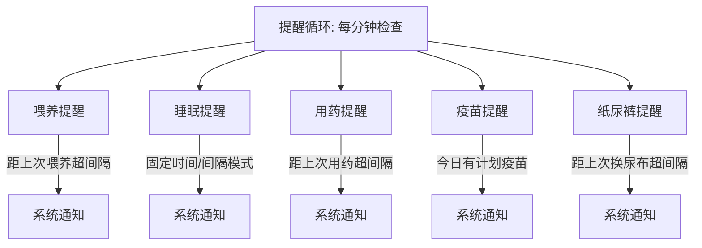

| 提醒类型 | 触发条件 | 节流间隔 | 可配参数 |
|----------|----------|----------|----------|
| 喂养 | 距上次喂养 > 间隔（或年龄推荐） | 5 分钟 | 间隔小时数 |
| 睡眠 | 固定时间模式：就寝时间 ±1h<br>间隔模式：距上次 > 间隔 | 5 分钟 | 就寝时间 + 间隔 |
| 用药 | 距上次用药 > 间隔 | 30 分钟 | 间隔小时数 |
| 疫苗 | 今日有计划疫苗 | 每日一次 | - |
| 纸尿裤 | 距上次更换 > 间隔 | 5 分钟 | 间隔小时数 |

**年龄推荐喂养间隔**：

| 年龄 | 间隔 |
|------|------|
| 0-1月 | 2.5h |
| 1-3月 | 3h |
| 3-6月 | 3.5h |
| 6-9月 | 4h |
| 9-12月 | 4.5h |
| 12月+ | 5h |

---

## 10. 数据导入导出

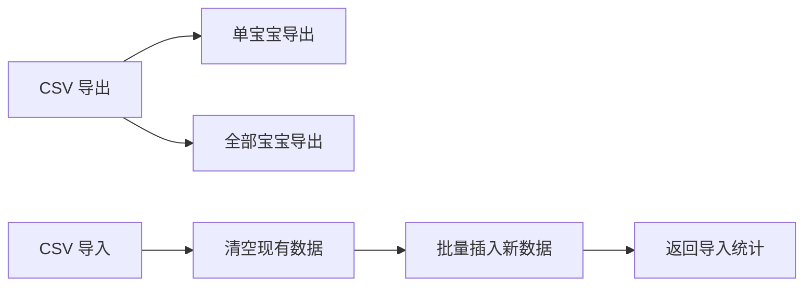

**导出**：
- 统一 CSV 宽表格式，双语标签（中文/英文）
- 支持单宝宝或全部宝宝合并导出
- UTF-8 BOM 头（Excel 兼容）
- 列：记录类型、日期、时间、结束日期、结束时间、项目、数值、时长、状态、备注

**导入**：
- 兼容新旧格式（`breast·left` / `breast_left` / `亲喂·左侧`）
- 自动检测多宝宝数据并创建宝宝记录
- 事务性导入：先清空再批量插入
- 返回每种类型的导入数量统计

---

## 11. 设置页

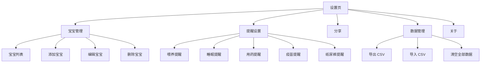

---

## 12. 数据模型

### 数据库（Dexie/IndexedDB）

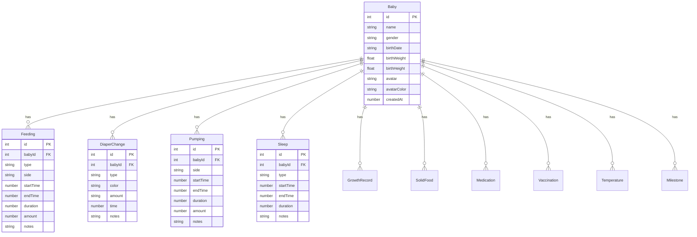

### 索引

| 表 | 索引 |
|----|------|
| feedings | `++id, babyId, [babyId+startTime], startTime` |
| diapers | `++id, babyId, [babyId+time], time` |
| pumpings | `++id, babyId, [babyId+startTime], startTime` |
| sleeps | `++id, babyId, [babyId+startTime], startTime` |
| growths | `++id, babyId, [babyId+date], date` |
| solidFoods | `++id, babyId, [babyId+time], time` |
| medications | `++id, babyId, [babyId+time], time` |
| vaccinations | `++id, babyId, [babyId+date], date` |
| temperatures | `++id, babyId, [babyId+time], time` |
| milestones | `++id, babyId, [babyId+time], time` |

---

## 13. 国际化

- 支持中文（zh-CN）和英文（en-US）
- 通过 vue-i18n 实现
- 所有用户可见文本均通过 `t()` 函数调用
- CSV 导出使用双语标签
- 浏览器语言自动检测，可在设置中切换

---

## 14. PWA特性

- **可安装**：通过 manifest.json 支持添加到主屏幕
- **离线可用**：Service Worker 缓存核心资源
- **自适应图标**：支持 maskable 图标
- **Hash 路由**：兼容静态托管（Cloudflare Pages）
